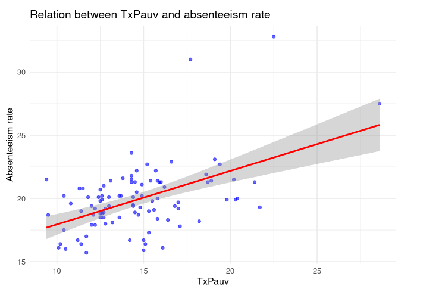
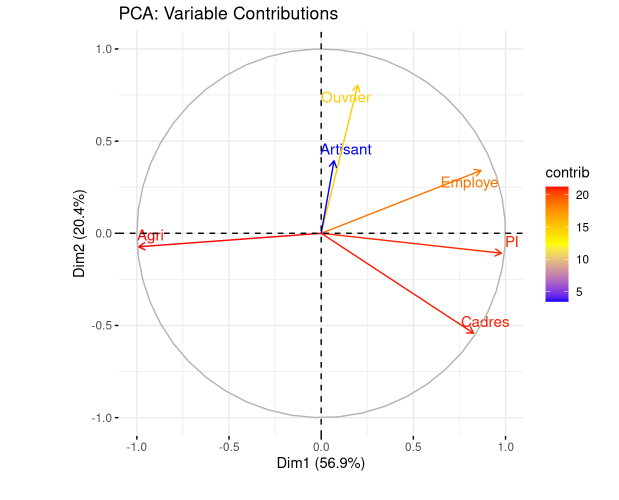
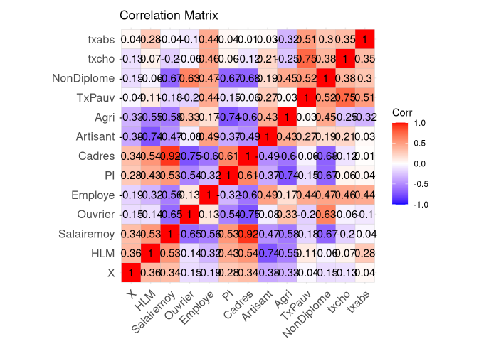
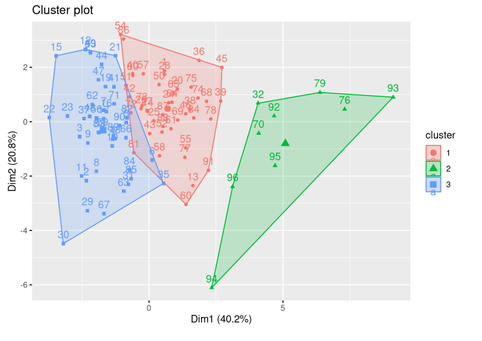

# Demos

This analysis aims to understand the socio-economic differences between French départements and their link with electoral abstention rates. It uses data mining, principal component analysis (PCA) and clustering to identify typological profiles of departments.  

## Problematic  

*How do the socio-economic characteristics of a département influence the abstention rate at elections? Can we identify homogeneous groups of départements based on these criteria, and formulate recommendations to reduce abstention?*

## Summary of methodology

### Univariate and bivariate exploration:

Analysis of distributions and relationships between key variables.  
*Example*: Correlation between poverty rate and abstention rate  
  

### Principal Component Analysis (PCA):
Dimensionality reduction to highlight relationships between variables.  
Visualization of departments in 2D space  
  

### In depth correlation :  
Identification of variables most associated with abstention rates  

### Clustering :
Segmentation of departments into 3 clusters.
Characterization of each cluster based on socio-economic variables  

## Summary of results  

### Main cluster characteristics  
**Cluster 1** (Socioeconomically moderate, high TxPauv) :  
Average wage: ~25.65  
High poverty rate: ~35.37%.  
Abstention: Relatively high (~19.90%).  

**Cluster 2** (Urbanized, high socio-economic level):  
Average wage: ~16.38  
Low poverty rate: ~15.56%.  
Abstention: Highest (~20.98%).  

**Cluster 3** (Rural and precarious):  
Average wage: ~12.75  
Moderate poverty rate: ~14.39%.  
Abstention: Low (~19.71%).  

### Correlations with abstention  
*Poverty rate*: Strong positive correlation.  
*Uneducated population*: Significant impact in rural areas.  
*Socio-professional composition*: Complex links, particularly with blue-collar and managerial workers.  

## What's next?
Thanks to the identification of the different clusters, we can take targeted action to reduce electoral abstention.  
In particular, we can step up information campaigns in disadvantaged areas (for Cluster 1).  
Then, we can create digital tools targeting young urban workers (for Cluster 2).  
Finally, we can mobilize community associations in rural areas (for Cluster 3).  